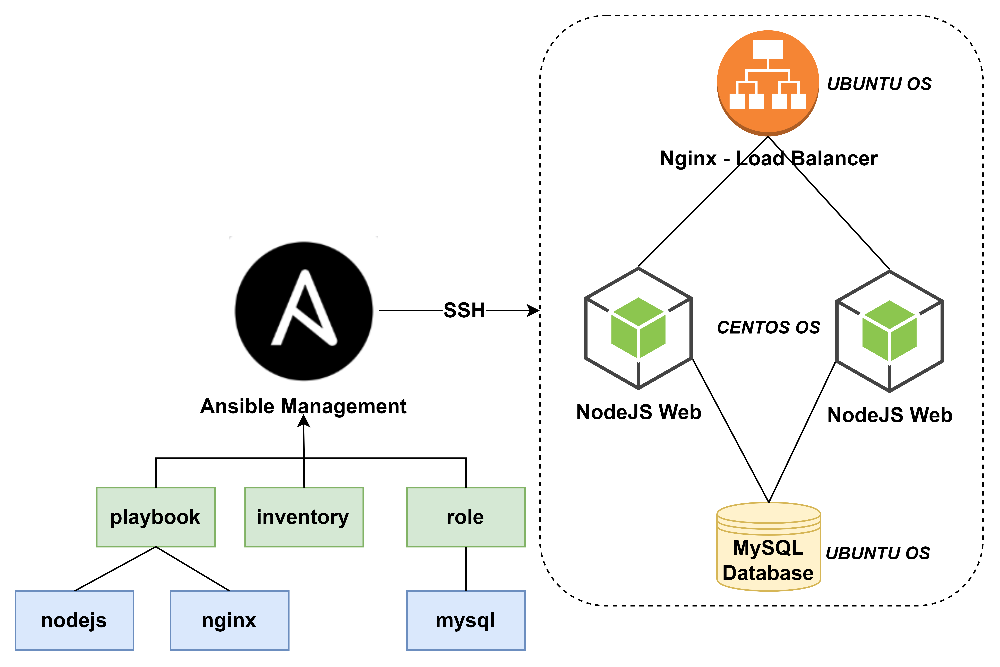
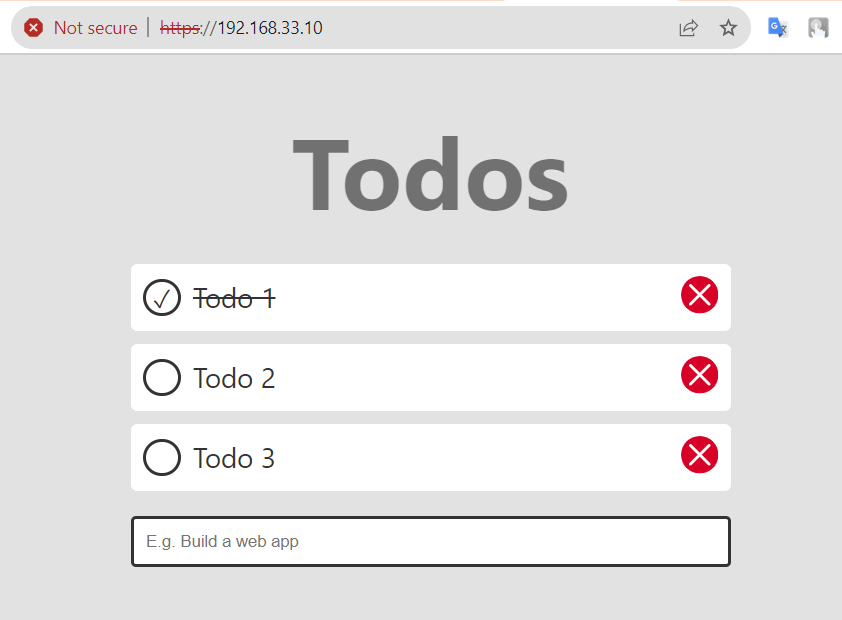

# Node.js Web App Deployment with Ansible

## Description
This project demonstrates the deployment of a Node.js web application using Ansible. It includes the setup of a MySQL database, multiple Node.js instances, and a load balancing mechanism for distributing traffic.

## Architecture


## Task Description
### MySQL Database Role
1. Create mysql role
2. Install mysql if not exist
3. Configure mysql: host, port, v.v.
4. Copy database dump file to database host
5. Create and import web database
6. Create new database user and grant web database role for that user

### NodeJS Web Playbook
1. Update packages
2. Install GCC
3. Install NodeJS
4. Install npm
5. Install pm2
6. Copy source code of web to web hosts
5. Copy template .env of web to web hosts
6. Install all dependency packages
6. Stop pm2 web process if exist
7. Start pm2 web process
8. Enable firewall for web

### Load Balancer Playbook
1. Update packages
2. Install nginx
3. Copy file configure load balancer of web to remote host
4. Generate SSL certificate if not exists
5. Restart nginx

## Prerequisites
1. Ansible on Ansible Management Node
2. Ansible Management Node must be able ssh to deployment nodes with ssh key


## Configuration
All configuration of project are locate in /inventories/main.yml


## Usage
1. Clone this repository
2. Copy example invetory file to main invertory
```bash
    cp ./inventories/main.sample.yml ./inventories/main.yml
```
3. Modify all configuration of project in inventory file: ``./inventories/main.yml``
4. Run ansible deployment
```bash
    bash deploy.sh
```
5. Access web on browser with URL: [https://(LoadBalancerIP)](https://(LoadBalancerIP))

